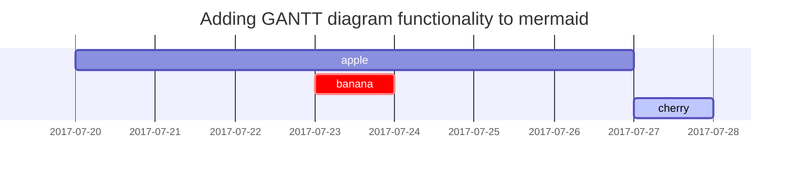

I plan to write about Diffusion model in these series. I believe writing these would help me deepen the understanding as I progress in my research.

### Prerequisites
Multivariable calculus and probability theory are required to understand the models. Further, the series starts from autoencoders so basics of deep learning on neural nets is a must.

Following is description of each blog as part of the series:

### Timeline

Part 0(current)
: Introduction to the series along with discussion on generative models and ELBO.

Part 1
: Variational Autoencoders (VAE) and their Heirarchial variant (HVAE).

Part 2
: Denoising diffusion probabilistic models (DDPM).

Part 3
: Score based generative modeling.

Part 4
: Denoising diffusion implicit models (DDIM).

## Generative Models
Assuming access to samples $x$ from a dataset $X$, goal of generative models is to learn the underlying distribution $p(x)$. Explicitly, $x$ is some $d$-dimensional random variable and $p$ is the distribution of interest that assigns higher values to some $x$ over others. For a dataset of images of cats, $p$ is the distribution that assigns high values to $x$ which when viewed in a grid, looks like a cat. We intiailly develop the understanding of diffusion models as likelihood-based generative models which want to maximise the $p(x)$. Let $\theta$ be parameters of the distribution our models currently estimated. Then the objective is formally to,

$$
\max_\theta p_{\theta}(x) \quad \forall x \in X
$$

For simplicity, we shall drop the $\theta$ in the math and reuse it in final equations. In essence, we are building a model that improves its estimate of distribution by maximising it on samples from the dataset.

We now assume that there exists some latent random variable $z$ that captures the data i.e inputs $x$ are mapped to $z$ such that underlying latent space of $z$ is rich and meaningful. For example, images of cats are mapped onto a tight region in latent space seperated from mappings of images of dogs. With this, we can write the prior $p(x)$ as,

$$
p(x) = \int p(x, z) \, dz \quad \text{( i.e., marginalizing out } z\text{ )}
$$

Or, with access to the distribution $p(z|x)$,

$$
p(x) = \frac{p(x, z)}}p(z|x)}
$$
## Block Quote

> This line shows the _block quote_.

## Prompts

<!-- markdownlint-capture -->
<!-- markdownlint-disable -->
> An example showing the `tip` type prompt.
{: .prompt-tip }

> An example showing the `info` type prompt.
{: .prompt-info }

> An example showing the `warning` type prompt.
{: .prompt-warning }

> An example showing the `danger` type prompt.
{: .prompt-danger }
<!-- markdownlint-restore -->

## Tables

| Company                      | Contact          | Country |
| :--------------------------- | :--------------- | ------: |
| Alfreds Futterkiste          | Maria Anders     | Germany |
| Island Trading               | Helen Bennett    |      UK |
| Magazzini Alimentari Riuniti | Giovanni Rovelli |   Italy |

## Links

<http://127.0.0.1:4000>

## Footnote

Click the hook will locate the footnote[^footnote], and here is another footnote[^fn-nth-2].

## Inline code

This is an example of `Inline Code`.

## Filepath

Here is the `/path/to/the/file.extend`{: .filepath}.

## Code blocks

### Common

```text
This is a common code snippet, without syntax highlight and line number.
```

### Specific Language

```bash
if [ $? -ne 0 ]; then
  echo "The command was not successful.";
  #do the needful / exit
fi;
```

### Specific filename

```sass
@import
  "colors/light-typography",
  "colors/dark-typography";
```
{: file='_sass/jekyll-theme-chirpy.scss'}

## Mathematics

The mathematics powered by [**MathJax**](https://www.mathjax.org/):

$$
\begin{equation}
  \sum_{n=1}^\infty 1/n^2 = \frac{\pi^2}{6}
  \label{eq:series}
\end{equation}
$$

We can reference the equation as \eqref{eq:series}.

When $a \ne 0$, there are two solutions to $ax^2 + bx + c = 0$ and they are

$$ x = {-b \pm \sqrt{b^2-4ac} \over 2a} $$

## Mermaid SVG



## Images
<!-- 
### Default (with caption)

{: width="972" height="589" }
_Full screen width and center alignment_

### Left aligned

{: width="972" height="589" .w-75 .normal}

### Float to left

{: width="972" height="589" .w-50 .left}
Praesent maximus aliquam sapien. Sed vel neque in dolor pulvinar auctor. Maecenas pharetra, sem sit amet interdum posuere, tellus lacus eleifend magna, ac lobortis felis ipsum id sapien. Proin ornare rutrum metus, ac convallis diam volutpat sit amet. Phasellus volutpat, elit sit amet tincidunt mollis, felis mi scelerisque mauris, ut facilisis leo magna accumsan sapien. In rutrum vehicula nisl eget tempor. Nullam maximus ullamcorper libero non maximus. Integer ultricies velit id convallis varius. Praesent eu nisl eu urna finibus ultrices id nec ex. Mauris ac mattis quam. Fusce aliquam est nec sapien bibendum, vitae malesuada ligula condimentum.

### Float to right

{: width="972" height="589" .w-50 .right}
Praesent maximus aliquam sapien. Sed vel neque in dolor pulvinar auctor. Maecenas pharetra, sem sit amet interdum posuere, tellus lacus eleifend magna, ac lobortis felis ipsum id sapien. Proin ornare rutrum metus, ac convallis diam volutpat sit amet. Phasellus volutpat, elit sit amet tincidunt mollis, felis mi scelerisque mauris, ut facilisis leo magna accumsan sapien. In rutrum vehicula nisl eget tempor. Nullam maximus ullamcorper libero non maximus. Integer ultricies velit id convallis varius. Praesent eu nisl eu urna finibus ultrices id nec ex. Mauris ac mattis quam. Fusce aliquam est nec sapien bibendum, vitae malesuada ligula condimentum.

### Dark/Light mode & Shadow

The image below will toggle dark/light mode based on theme preference, notice it has shadows.

{: .light .w-75 .shadow .rounded-10 w='1212' h='668' }
{: .dark .w-75 .shadow .rounded-10 w='1212' h='668' }
 -->
## Video



## Reverse Footnote

[^footnote]: The footnote source
[^fn-nth-2]: The 2nd footnote source
